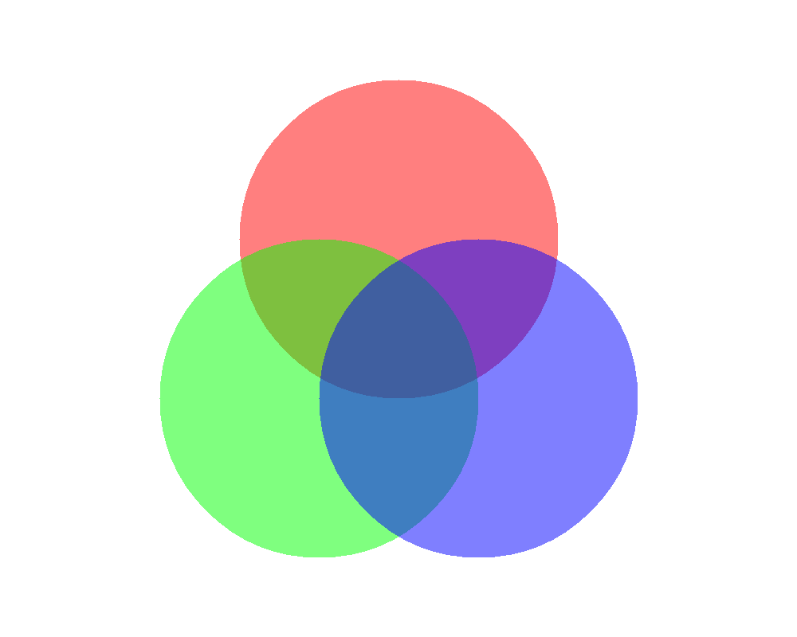
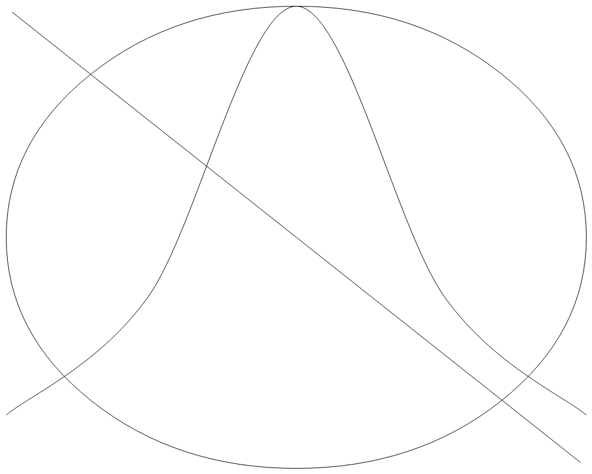

# Aspose.Drawing.Common as an alternative to System.Drawing.Common 2D graphics engine for .NET

&nbsp;&nbsp;&nbsp;&nbsp;&nbsp;&nbsp;&nbsp;&nbsp;
The alternative to the System.Drawing.Common library has become more relevant since Microsoft announced restrictions on its usage for .NET6 on non-Windows platforms due to the lack of support for 3rd party native libraries that the Microsoft library relies on. The Aspose package is compatible with any 32-bit or 64-bit operating system where .NET Standard 2.0, NET Core 3.1, NET6, NET7, NET8 and higher is installed and fully supports the System.Drawing.Common API. Aspose.Drawing.Common is not just a drawing library for Windows; it is also a cross-platform software, free from the shortcomings of the System.Drawing.Common library, and even surpasses other competitors' solutions.

## Aspose.Drawing.Common features description

&nbsp;&nbsp;&nbsp;&nbsp;&nbsp;&nbsp;&nbsp;&nbsp;
The Aspose.Drawing library offers an extensive set of 2D drawing features, including various methods for drawing lines, Bezier curves, splines, arcs, and shapes like rectangles, polygons, and ellipses, as well as processing and drawing graphics paths. Furthermore, it allows you to draw text strings as well. In contrast to other drawing libraries, Aspose provides high-quality rendering of text with anti-aliasing and hinting, ensuring that font edges appear smooth without jagged edges, and letters are readable on any kind of displays and resolutions. Aspose.Drawing has an advantage over other libraries as it also supports strikeout or underline font rendering and possibility to draw text in the shapes with alignment.

<figure class="frame">

<figcaption>Rendering text with font hinting</figcaption>

</figure>

&nbsp;&nbsp;&nbsp;&nbsp;&nbsp;&nbsp;&nbsp;&nbsp;
When drawing graphics, you have the flexibility to configure a pen with various colors, widths, and line styles, such as solid lines, dash lines, dot lines, or any custom combination of dashes and dots. Additionally, you can use solid and texture brushes to draw shapes. Moreover, you can utilize alpha blending and anti-aliasing for lines and shapes, allowing you to create semi-transparent objects that blend smoothly with a background image.

<figure class="frame">

<figcaption>Drawing with alfa-blending</figcaption>

</figure>

<figure class="frame">

<figcaption>Drawing with anti-aliasing line</figcaption>

</figure>

&nbsp;&nbsp;&nbsp;&nbsp;&nbsp;&nbsp;&nbsp;&nbsp;
By utilizing the clipping regions method, you can create visually attractive pictures with fascinating designs. With the Aspose.Drawing library, you can draw graphics objects and then manipulate them by moving or stretching them using affine transformations.

You can follow a link to the <a href="https://docs.aspose.com/drawing/net/feature-list/">Aspose.Drawing for .NET documentation</a> for a full feature list.

## Aspose.Drawing supported image formats

&nbsp;&nbsp;&nbsp;&nbsp;&nbsp;&nbsp;&nbsp;&nbsp;
Using the Aspose.Drawing library, you can create drawings on a new bitmap or load an image from an existing file. Drawings are stored in memory as pixel arrays, and you have different options to save the final graphics as raster images into another image file. Unlike other libraries, the Aspose library supports a wide range of popular file formats, including TIFF, BMP, PNG, JPEG, GIF, WMF, and EMF.

&nbsp;&nbsp;&nbsp;&nbsp;&nbsp;&nbsp;&nbsp;&nbsp;
The Aspose.Drawing.Common package can be downloaded from the <a href="https://www.nuget.org/packages/Aspose.Drawing.Common">NuGet package manager repository</a>. For the API description, please refer to the <a href="https://products.aspose.com/drawing/net/">Aspose .NET APIs for 2D Graphics Drawing</a> product page.

