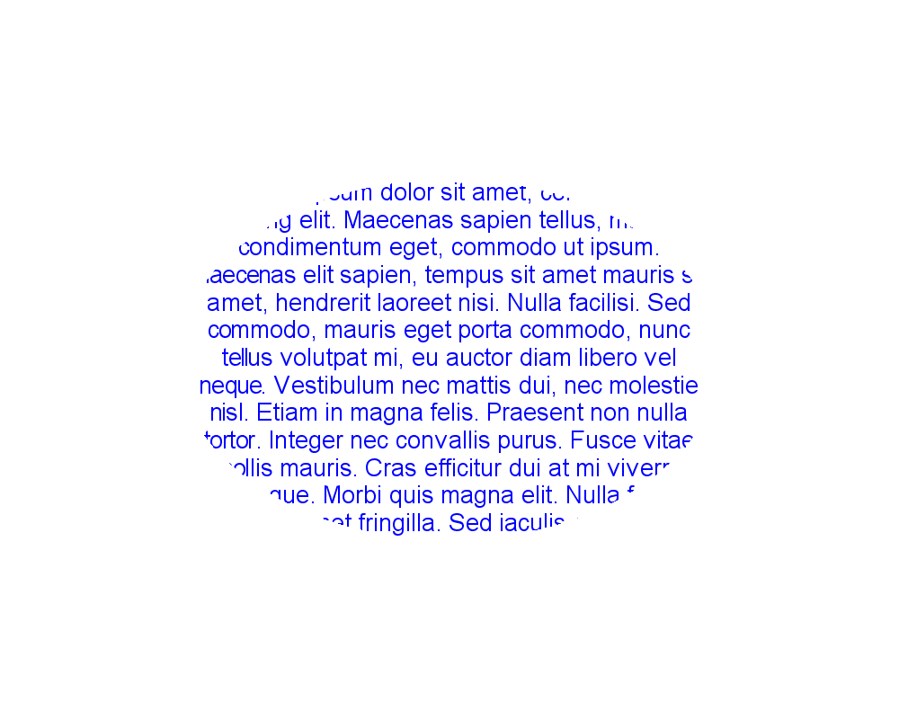

<style>
   .frame {
    border: 2px solid darkgray;
    padding: 5px;
    margin: 10px 0 5px 5px;
    background: #f0f0f0;
    align-items: center;
   }
   .frame figcaption {
    margin: 0 auto 5px;
	display: flex;
    flex-direction: row;
    justify-content: space-around;

   }
</style>

# Cross-platform drawing API for C# (.NET)

<p align='justify'>
&nbsp;&nbsp;&nbsp;&nbsp;&nbsp;&nbsp;&nbsp;&nbsp;
The Asp.Drawing library provides a cross-platform C# API for creating geometric drawings. With Asp.Drawing, you can effortlessly draw vector images such as lines, shapes, rectangles, polygons, arcs, Bezier curves, and text with various fonts and styles. Additionally, you can apply different transformations to 2D objects and save the results as raster or vector files. You can utilize the same Aspose library as a drawing API for Windows, Linux, Azure, or as a graphic API for ASP sites, ensuring consistent quality and performance across all target platforms.
</p>

## How drawing lines and shapes

<p align='justify'>
&nbsp;&nbsp;&nbsp;&nbsp;&nbsp;&nbsp;&nbsp;&nbsp;
In this example, we demonstrate how to create a series of graphic primitives, including lines, rectangles, and ellipses, using the <a href="https://reference.aspose.com/imaging/net/aspose.imaging/graphics/drawpath/">DrawPath method</a>. To start, we create a bitmap with a size of `1000x800` pixels and a color depth of 32 bits per pixel. Next, we define a Pen object with two properties: the color set to `Blue` and a width of 2
pixels, which will be used for drawing the images, along with a <a href="https://reference.aspose.com/imaging/net/aspose.imaging/graphicspath/">Path object</a>. Following that, we sequentially add two lines to the Path, each defined by its starting and ending X, Y coordinates: one from (100, 100) to (1000, 400), and another line from (1000, 600) to (300, 600); a Rectangle with the following specifications: left upper corner at (0, 0), width of 200, and height of 400 pixels; and an Ellipse object fitted within a rectangle, positioned at the left upper corner (10, 200), with a width of 450 and a height of 300 pixels. Using the DrawPath method and the previously described Pen object, we draw the Path onto the created bitmap. Finally, we rasterize the image and save it as a PNG file.
</p>

C# code example:
```cs
using System.Drawing;
using System.Drawing.Drawing2D;

namespace Aspose.Drawing.Examples.CSharp.LinesCurvesShapes
{
    class DrawPath
    {
        public static void Run()
        {
            //ExStart: DrawPath
            Bitmap bitmap = new Bitmap(1000, 800, System.Drawing.Imaging.PixelFormat.Format32bppPArgb);
            Graphics graphics = Graphics.FromImage(bitmap);

            Pen pen = new Pen(Color.FromKnownColor(KnownColor.Blue), 2);
            GraphicsPath path = new GraphicsPath();
            path.AddLine(100, 100, 1000, 400);
            path.AddLine(1000, 600, 300, 600);
            path.AddRectangle(new Rectangle(500, 350, 200, 400));
            path.AddEllipse(10, 250, 450, 300);
            graphics.DrawPath(pen, path);

            bitmap.Save(RunExamples.GetDataDir() + @"LinesCurvesShapes\DrawPath_out.png");
            //ExEnd: DrawPath
        }
    }
}
```

<p align='justify'>
&nbsp;&nbsp;&nbsp;&nbsp;&nbsp;&nbsp;&nbsp;&nbsp;
The C# code above will draw the following image with Lines, Rectangles and Ellipses:
</p>

<figure class="frame">
<p>

<figcaption>Example of drawing lines, rectangles and ellipses</figcaption>
</p>
</figure>

You can find more examples in <a href="https://reference.aspose.com/imaging/net/aspose.imaging/graphics/drawpath/">Aspose documentation</a>.


## How to create geometric drawings with arcs and Bezier curves

<p align='justify'>
&nbsp;&nbsp;&nbsp;&nbsp;&nbsp;&nbsp;&nbsp;&nbsp;
Similar to the previous example of 2D geometrics drawings, to draw an arc, we begin by creating a 1000x800 bitmap and then proceed to create a Pen object with the color `Blue`` and a width of `2` px. Next, we create an arc object with <a href="https://reference.aspose.com/imaging/net/aspose.imaging/graphics/drawarc/">method `DrawArc`</a>. As method parameters, we pass the object `Pen`` followed by rectangle coordinates where our arc will be fitted: upper left point (0, 0) and bottom right point (700, 700). And the last two parameters are begin and end angles to draw the arc: from 0 degrees to 180 degrees. Angle in degrees measured clockwise from the x-axis to the starting point of the arc.
</p>

<p align='justify'>
&nbsp;&nbsp;&nbsp;&nbsp;&nbsp;&nbsp;&nbsp;&nbsp;
The C# code example to draw an arc:
</p>


<figure class="frame">
<p>

<figcaption>Example of drawing arc</figcaption>
</p>
</figure>

<p align='justify'>
&nbsp;&nbsp;&nbsp;&nbsp;&nbsp;&nbsp;&nbsp;&nbsp;
To draw a Bezier curve, you need to utilize the <a href="https://reference.aspose.com/imaging/net/aspose.imaging/graphics/drawbezier/">`DrawBezier` method</a>. This method takes a Pen object and four sets of coordinates representing Point objects, which are used to define the curve. The first point represents the starting point for drawing, followed by the first control point, the second control point, and finally, the ending point of the curve. The Aspose.Drawing graphic library automatically calculates and draws the Bezier curve from the starting point to the endpoint, taking into account the curve direction based on the control points.
</p>

<p align='justify'>
&nbsp;&nbsp;&nbsp;&nbsp;&nbsp;&nbsp;&nbsp;&nbsp;
The C# code example to draw a Bezier curve:
</p>

```cs
Bitmap bitmap = new Bitmap(1000, 800, System.Drawing.Imaging.PixelFormat.Format32bppPArgb);
Graphics graphics = Graphics.FromImage(bitmap);

Pen pen = new Pen(Color.FromKnownColor(KnownColor.Blue), 2);
PointF p1 = new PointF(0, 0);   // start point
PointF c1 = new PointF(0, 800);   // first control point
PointF c2 = new PointF(1000, 0);  // second control point
PointF p2 = new PointF(1000, 800);  // end point
graphics.DrawBezier(pen, p1, c1, c2, p2);

bitmap.Save(RunExamples.GetDataDir() + @"LinesCurvesShapes\DrawBezierSpline_out.png");
```

<figure class="frame">
<p>

<figcaption>Example of drawing Bezier spline curve</figcaption>
</p>
</figure>


## How to render text

<p align='justify'>
&nbsp;&nbsp;&nbsp;&nbsp;&nbsp;&nbsp;&nbsp;&nbsp;
Let's try a more intricate example with text drawing. We will render a text with anti-aliasing and clip it within an elliptical area. To begin, we create a graphics object using a bitmap with dimensions 1000x800 px, and then set the `TextRenderingHint` graphics property to `AntiAliasGridFit`. Next, we create a `GraphicsPath` object representing a rectangle with coordinates from (200, 200) to (600, 400). We then clip an ellipse area that fits within this rectangle. Afterward, we create a `StringFormat` object, a `Brush` object, set the alignment, and select an appropriate font with the desired size and style. Finally, we use the <a href="https://reference.aspose.com/imaging/net/aspose.imaging/graphics/drawstring/">`DrawString` method</a> to create a text string with the clipped ellipse area.
</p>

<p align='justify'>
&nbsp;&nbsp;&nbsp;&nbsp;&nbsp;&nbsp;&nbsp;&nbsp;
The C# code example to draw a text string:
</p>

```cs
Bitmap bitmap = new Bitmap(1000, 800, System.Drawing.Imaging.PixelFormat.Format32bppPArgb);
Graphics graphics = Graphics.FromImage(bitmap);
graphics.TextRenderingHint = TextRenderingHint.AntiAliasGridFit;

Rectangle rectangle = new Rectangle(200, 200, 600, 400);
GraphicsPath clipPath = new GraphicsPath();
clipPath.AddEllipse(rectangle);
graphics.SetClip(clipPath);

StringFormat stringFormat = new StringFormat();
stringFormat.Alignment = StringAlignment.Center;
stringFormat.LineAlignment = StringAlignment.Center;
Brush brush = new SolidBrush(Color.FromKnownColor(KnownColor.Blue));
Font arial = new Font("Arial", 20, FontStyle.Regular);
string text = "Lorem ipsum dolor sit amet, consectetur adipiscing elit. Maecenas sapien tellus, mattis et condimentum eget, commodo ut ipsum. Maecenas elit sapien, tempus sit amet mauris sit amet, hendrerit laoreet nisi. Nulla facilisi. Sed commodo, mauris eget porta commodo, nunc tellus volutpat mi, eu auctor diam libero vel neque. Vestibulum nec mattis dui, nec molestie nisl. Etiam in magna felis. Praesent non nulla tortor. Integer nec convallis purus. Fusce vitae mollis mauris. Cras efficitur dui at mi viverra scelerisque. Morbi quis magna elit. Nulla facilisis id ante sit amet fringilla. Sed iaculis consectetur lectus a interdum. Etiam ut sollicitudin lectus, et congue lectus.";
graphics.DrawString(text, arial, brush, rectangle, stringFormat);

bitmap.Save(RunExamples.GetDataDir() + @"Rendering\Clipping_out.png");
```

<figure class="frame">
<p>

<figcaption>Example of drawing text string with clipping</figcaption>
</p>
</figure>

For more examples please visit Aspose's official GitHub repository: <a href="https://github.com/aspose-drawing/Aspose.Drawing-for-.NET">Aspose.Drawing for .NET</a>.
