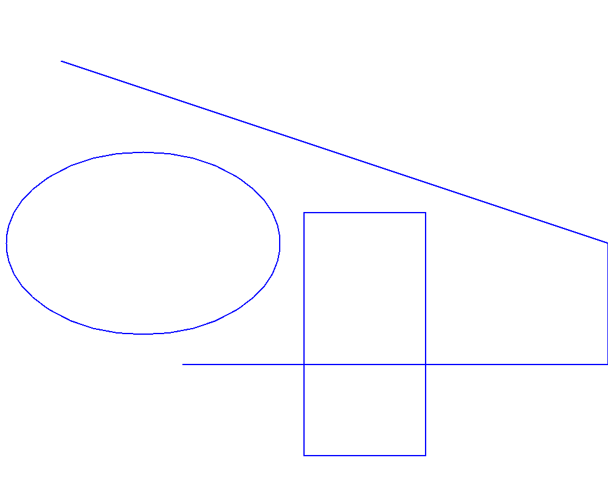

<style>
   .frame {
    border: 2px solid darkgray;
    padding: 5px;
    margin: 10px 0 5px 5px;
    background: #f0f0f0;
   }
   .frame figcaption {
    margin: 0 auto 5px;
   }
</style>

# Cross platform drawing API for C# (.NET)

## How drawing lines and shapes

<p align='justify'>
&nbsp;&nbsp;&nbsp;&nbsp;&nbsp;&nbsp;&nbsp;&nbsp;
In this example, we demonstrate how to create a series of graphic primitives, including lines, rectangles, and ellipses, using the <a href="https://reference.aspose.com/imaging/net/aspose.imaging/graphics/drawpath/">DrawPath method</a>. To start, we create a bitmap with a size of `1000x800` pixels and a color depth of 32 bits per pixel. Next, we define a Pen object with two properties: the color set to `Blue` and a width of 2
pixels, which will be used for drawing the images, along with a <a href="https://reference.aspose.com/imaging/net/aspose.imaging/graphicspath/">Path object</a>. Following that, we sequentially add two lines to the Path, each defined by its starting and ending X, Y coordinates: one from (100, 100) to (1000, 400), and another line from (1000, 600) to (300, 600); a Rectangle with the following specifications: left upper corner at (0, 0), width of 200, and height of 400 pixels; and an Ellipse object fitted within a rectangle, positioned at the left upper corner (10, 200), with a width of 450 and a height of 300 pixels. Using the DrawPath method and the previously described Pen object, we draw the Path onto the created bitmap. Finally, we rasterize the image and save it as a PNG file.
</p>

C# code example:
```cs
using System.Drawing;
using System.Drawing.Drawing2D;

namespace Aspose.Drawing.Examples.CSharp.LinesCurvesShapes
{
    class DrawPath
    {
        public static void Run()
        {
            //ExStart: DrawPath
            Bitmap bitmap = new Bitmap(1000, 800, System.Drawing.Imaging.PixelFormat.Format32bppPArgb);
            Graphics graphics = Graphics.FromImage(bitmap);

            Pen pen = new Pen(Color.FromKnownColor(KnownColor.Blue), 2);
            GraphicsPath path = new GraphicsPath();
            path.AddLine(100, 100, 1000, 400);
            path.AddLine(1000, 600, 300, 600);
            path.AddRectangle(new Rectangle(500, 350, 200, 400));
            path.AddEllipse(10, 250, 450, 300);
            graphics.DrawPath(pen, path);

            bitmap.Save(RunExamples.GetDataDir() + @"LinesCurvesShapes\DrawPath_out.png");
            //ExEnd: DrawPath
        }
    }
}
```

<p align='justify'>
&nbsp;&nbsp;&nbsp;&nbsp;&nbsp;&nbsp;&nbsp;&nbsp;
The C# code above will draw the following image with Lines, Rectangles and Ellipses:
</p>

<figure class="frame">
<p>

<figcaption>Example of drawing lines, rectangles and ellipses</figcaption>
</p>
</figure>

You can find more examples in <a href="https://reference.aspose.com/imaging/net/aspose.imaging/graphics/drawpath/">Aspose documentation</a>.


## How to make geometric drawings with arcs and Bezier curves

<p align='justify'>
&nbsp;&nbsp;&nbsp;&nbsp;&nbsp;&nbsp;&nbsp;&nbsp;



<figure class="frame">
<p>

<figcaption>Example DrawArc</figcaption>
</p>
</figure>

<a href="https://github.com/aspose-drawing/Aspose.Drawing-for-.NET">Aspose.Drawing for .NET Examples</a>

</p>


## How to render text
