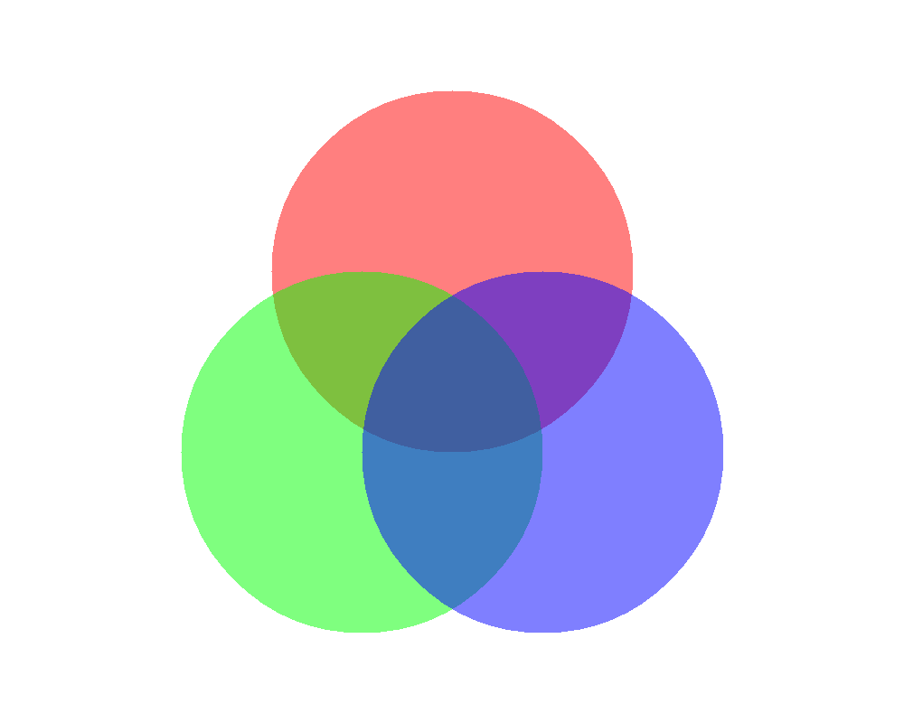

# System.Drawing.Common replacement with Aspose.Drawing for .NET

<p align='justify'>
&nbsp;&nbsp;&nbsp;&nbsp;&nbsp;&nbsp;&nbsp;&nbsp;
Creating images using graphic libraries can be a challenging task for developers, researchers, students, and managers involved in building graphic applications and services on the Microsoft .NET platform. Aspose.Drawing is a contemporary cross-platform graphic drawing library that offers advanced features and functionality. By utilizing the Aspose library for .NET (C#), developers can efficiently draw images with lines and shapes using diverse Pen and Brush objects, generate texts with varying fonts and styles, perform different transformations, and render drawings into popular graphics file formats. This readily-available graphic library significantly boosts productivity, drastically reduces development time, and accelerates time-to-market. Microsoft's System.Drawing.Common library has recently altered its support for non-Windows platforms, making Aspose.Drawing.Common a suitable alternative for image drawings.
</p>


## System.Drawing.Common limitations

<p align='justify'>
&nbsp;&nbsp;&nbsp;&nbsp;&nbsp;&nbsp;&nbsp;&nbsp;
On May 22, 2023, the Microsoft Learn portal published an article detailing a significant change: <a href="https://learn.microsoft.com/en-us/dotnet/core/compatibility/core-libraries/6.0/system-drawing-common-windows-only">System.Drawing.Common only supported on Windows</a>. If you attempt to compile a .NET6 program using the System.Drawing.Common package on non-Windows environments, you will encounter an exception indicating that your platform is not supported. Although it is possible to disable this warning on .NET6, it is strongly recommended to migrate to alternative libraries.
</p>

<p align='justify'>
&nbsp;&nbsp;&nbsp;&nbsp;&nbsp;&nbsp;&nbsp;&nbsp;
This issue arises from the fact that System.Drawing.Common relies on a 3rd party graphic library called `GDP+`, which includes native code and lacks necessary functionality. Additionally, `GDP+` has external dependencies on other native libraries like `cairo` and `pango`. When using System.Drawing.Common on platforms different from Windows, you may encounter unpredictable behavior and platform errors within your drawing application. As a consequence, your rendered images may appear different on other platforms, leading to unexpected results.
</p>


## Why choose Aspose.Drawing.Common for System.Drawing.Common replacement

<p align='justify'>
&nbsp;&nbsp;&nbsp;&nbsp;&nbsp;&nbsp;&nbsp;&nbsp;
Fortunately, Aspose.Drawing.Common avoids these drawbacks by not depending on any 3rd party libraries. It includes all the necessary rendering engines for all supported platforms, ensuring consistent rendering results. Aspose.Drawing.Common for Microsoft .NET is a robust cross-platform programming library for 2D graphics drawing. The Aspose library serves as a viable alternative to the System.Drawing.Common package. Aspose.Drawing proves to be an excellent option for developing drawing applications using .NET Standard 2.0, NET Core 3.1, NET6, NET7, NET8 and higher, Xamarin applications for Windows, Linux, Android, Azure Functions, or Blazor WebAssembly.
</p>


## How to replace System.Drawing.Common for your project

<p align='justify'>
&nbsp;&nbsp;&nbsp;&nbsp;&nbsp;&nbsp;&nbsp;&nbsp;
Upgrading from System.Drawing.Common to Aspose.Drawing.Common is a seamless and straightforward process. Aspose.Drawing.Common offers a fully compatible C# API, preserving the same class names, functions, and interfaces. To migrate, simply update your project reference from `System` to `Aspose` and recompile the application. Once completed, your application will work smoothly across different platforms, delivering consistent results. You can conveniently download a trial package of <a href="https://www.nuget.org/packages/Aspose.Drawing.Common">Aspose.Drawing.Common from Nuget packages portal</a> or directly obtain the .DLL file from the <a href="https://releases.aspose.com/drawing/net/">Aspose releases portal</a>. For detailed instructions on installing Aspose.Drawing, please refer to the <a href="https://docs.aspose.com/drawing/net/installation/">Aspose.Drawing installation guide</a>.
</p>

## Conclusion

<p align='justify'>
&nbsp;&nbsp;&nbsp;&nbsp;&nbsp;&nbsp;&nbsp;&nbsp;
Microsoft's System.Drawing.Common drawing library for Windows has significant shortcomings when used on non-Windows platforms due to its dependencies on 3rd party native libraries. Considering Microsoft's recent article regarding the breaking change of behavior on non-Windows platforms for .NET6 and their migration recommendations, Aspose.Drawing serves as a suitable replacement for System.Drawing. Aspose.Drawing can be effortlessly implemented on diverse platforms as a robust 2D graphic engine, effectively resolving compatibility issues and enhancing rendering quality.
</p>
---
title: Aspose.Drawing.Common as an alternative to System.Drawing.Common 2D graphics engine for .NET
description: Alt draw pictures with Aspose.Drawing.Common C# API for image drawing. Cross platform drawing library for support 2D drawing including drawing lines, drawing shapes and bezier curves. Using affine transformation, anti-aliasing lines and shapes. Rendering text with different styles and fonts.
keywords: [
drawing pictures,
anti aliasing,
alt draw,
dot net,
affine transformation,
bezier curves,
nuget package,
alpha blending,
rendering text,
Drawing library for Windows
]
---

<style>
   .frame {
    border: 2px solid darkgray;
    padding: 5px;
    margin: 10px 0 5px 5px;
    background: #f0f0f0;
    align-items: center;
   }
   .frame figcaption {
    margin: 0 auto 5px;
    display: flex;
    flex-direction: row;
    justify-content: space-around;

   }
</style>

# Aspose.Drawing.Common as an alternative to System.Drawing.Common 2D graphics engine for .NET

<p align='justify'>
&nbsp;&nbsp;&nbsp;&nbsp;&nbsp;&nbsp;&nbsp;&nbsp;
The alternative to the System.Drawing.Common library has become more relevant since Microsoft announced restrictions on its usage for .NET6 on non-Windows platforms due to the lack of support for 3rd party native libraries that the Microsoft library relies on. The Aspose package is compatible with any 32-bit or 64-bit operating system where .NET Standard 2.0, NET Core 3.1, NET6, NET7, NET8 and higher is installed and fully supports the System.Drawing.Common API. Aspose.Drawing.Common is not just a drawing library for Windows; it is also a cross-platform software, free from the shortcomings of the System.Drawing.Common library, and even surpasses other competitors' solutions.
</p>

## Aspose.Drawing.Common features description

<p align='justify'>
&nbsp;&nbsp;&nbsp;&nbsp;&nbsp;&nbsp;&nbsp;&nbsp;
The Aspose.Drawing library offers an extensive set of 2D drawing features, including various methods for drawing lines, Bezier curves, splines, arcs, and shapes like rectangles, polygons, and ellipses, as well as processing and drawing graphics paths. Furthermore, it allows you to draw text strings as well. In contrast to other drawing libraries, Aspose provides high-quality rendering of text with anti-aliasing and hinting, ensuring that font edges appear smooth without jagged edges, and letters are readable on any kind of displays and resolutions. Aspose.Drawing has an advantage over other libraries as it also supports strikeout or underline font rendering and possibility to draw text in the shapes with alignment.
</p>

<figure class="frame"><p>

<figcaption>Rendering text with font hinting</figcaption>
</p></figure>

<p align='justify'>
&nbsp;&nbsp;&nbsp;&nbsp;&nbsp;&nbsp;&nbsp;&nbsp;
When drawing graphics, you have the flexibility to configure a pen with various colors, widths, and line styles, such as solid lines, dash lines, dot lines, or any custom combination of dashes and dots. Additionally, you can use solid and texture brushes to draw shapes. Moreover, you can utilize alpha blending and anti-aliasing for lines and shapes, allowing you to create semi-transparent objects that blend smoothly with a background image.
</p>

<figure class="frame"><p>

<figcaption>Drawing with alfa-blending</figcaption>
</p></figure>

<figure class="frame"><p>

<figcaption>Drawing with anti-aliasing line</figcaption>
</p></figure>

<p align='justify'>
&nbsp;&nbsp;&nbsp;&nbsp;&nbsp;&nbsp;&nbsp;&nbsp;
By utilizing the clipping regions method, you can create visually attractive pictures with fascinating designs. With the Aspose.Drawing library, you can draw graphics objects and then manipulate them by moving or stretching them using affine transformations.
</p>

You can follow a link to the <a href="https://docs.aspose.com/drawing/net/">Aspose.Drawing for .NET documentation</a> for a full feature list.
</p>

## Aspose.Drawing supported image formats

<p align='justify'>
&nbsp;&nbsp;&nbsp;&nbsp;&nbsp;&nbsp;&nbsp;&nbsp;
Using the Aspose.Drawing library, you can create drawings on a new bitmap or load an image from an existing file. Drawings are stored in memory as pixel arrays, and you have different options to save the final graphics as raster images into another image file. Unlike other libraries, the Aspose library supports a wide range of popular file formats, including TIFF, BMP, PNG, JPEG, GIF, WMF, and EMF.
</p>

<p align='justify'>
&nbsp;&nbsp;&nbsp;&nbsp;&nbsp;&nbsp;&nbsp;&nbsp;
The Aspose.Drawing.Common package can be downloaded from the <a href="https://www.nuget.org/packages/Aspose.Drawing.Common">NuGet package manager repository</a>. For the API description, please refer to the <a href="https://products.aspose.com/drawing/net/">Aspose .NET APIs for 2D Graphics Drawing</a> product page.
</p>
---
title: Cross-platform graphics library for 2D drawing pictures for .NET
description: Aspose.Drawing library for Microsoft .NET to draw pictures. Cross-platform alternative to Microsoft NET System.Drawing.Common image drawing library for Windows 2D graphics. Nuget package download.
keywords: [
drawing pictures,
c sharp,
dot net,
asp net,
microsoft net,
nuget package,
image drawing,
2d drawing,
csharp net,
cross platform,
web assembly,
Drawing library for Windows,
Drawing library for Linux,
Drawing library for Azure,
Graphics library for ASP site,
Graphics library for Web application,
Drawing library for Blazor
]
---

# Cross-platform graphics library for 2D drawing pictures for .NET

<p align='justify'>
&nbsp;&nbsp;&nbsp;&nbsp;&nbsp;&nbsp;&nbsp;&nbsp;
Drawing libraries for Microsoft .NET are widely utilized for creating 2D drawing applications and services. Developing a C# (C sharp) application for image drawing that can run on multiple platforms enables you to reach a broader customer base with minimal effort. Aspose.Drawing is a cross-platform solution for .NET that supports the most popular platforms and consistently delivers excellent quality results.
</p>


## Aspose.Drawing supported platforms

<p align='justify'>
&nbsp;&nbsp;&nbsp;&nbsp;&nbsp;&nbsp;&nbsp;&nbsp;
Graphic libraries for .NET are not limited to the Windows platforms; they are also widely popular on other systems such as MacOS, Linux, Android, Azure Functions, ASP.NET WebApp and Blazor WebAssembly. One major advantage of Aspose.Drawing.Common is its cross-platform compatibility, allowing you to utilize it simultaneously on multiple platforms. Developing with a single library streamlines the application creation process. You can reuse code developed once across multiple platforms. Aspose.Drawing is compatible with all target platforms listed in the <a href="https://www.nuget.org/packages/Aspose.Drawing.Common#supportedframeworks-body-tab">Supported frameworks list</a>, making it suitable for any choice you make.
</p>


## How to install Aspose.Drawing for different platforms

<p align='justify'>
&nbsp;&nbsp;&nbsp;&nbsp;&nbsp;&nbsp;&nbsp;&nbsp;
If you are developing within the Visual Studio development environment, you can easily install Aspose.Drawing using the integrated NuGet package manager. Simply search for `Aspose`, select `Aspose.Drawing` or `Aspose.Drawing.Common`, and click Install. Alternatively, you can install Aspose.Drawing from the NuGet package manager command line by typing the following command:
</p>

```sh
> Install-Package Aspose.Drawing
```

For more detailed installation instructions please visit the
<a href="https://docs.aspose.com/drawing/net/installation/">Aspose.Drawing Installation Guide</a>.

<p align='justify'>
&nbsp;&nbsp;&nbsp;&nbsp;&nbsp;&nbsp;&nbsp;&nbsp;
Aspose.Drawing can serve as a graphic library for various target platforms, including Windows, MacOS, Linux, Azure, ASP sites, and Blazor WebAssembly applications. In Visual Studio, you have the flexibility to create new projects and run C# programs on .NET as Console Applications on Windows, Linux, or MacOS, as Web applications using ASP.NET Core or Blazor WebAssembly. Additionally, you can utilize the same Aspose drawing library for .NET MAUI applications on mobile platforms like Android or iOS.
</p>

<p align='justify'>
&nbsp;&nbsp;&nbsp;&nbsp;&nbsp;&nbsp;&nbsp;&nbsp;
To run a .NET application on Linux, you simply need to have .NET installed and ensure that `Aspose.Drawing.dll` is available in your project folder. You can download the binaries from the <a href="https://downloads.aspose.com/drawing/net">official Aspose website</a>. Alternatively, you can define the API using the command line command:
</p>

```sh
> dotnet add package Aspose.Drawing
```

<p align='justify'>
&nbsp;&nbsp;&nbsp;&nbsp;&nbsp;&nbsp;&nbsp;&nbsp;
Aspose.Drawing graphics library relies solely on its own rendering functions, eliminating the need to install any other 3rd party components. Furthermore, you can run C# applications with the Aspose library in a Docker container. For more information about Docker installation, please refer to the <a href="https://docs.aspose.com/drawing/net/how-to-run-aspose-drawing-in-docker/">Aspose.Drawing documentation</a>."
</p>
---
title: Cross-platform drawing C# API for .NET
description: Aspose.Drawing library for Microsoft .NET for drawing pictures. Cross-platform support of C# Graphics API for 2D geometric drawings such as drawing lines, drawing shapes, drawing path and drawing rectangles.
keywords: [drawing pictures,
lines drawing,
draw lines,
vector images,
vector file,
dot net,
drawing shapes,
geometric drawings,
c# api,
cross platform,
Drawing API for Windows,
Drawing API for Linux,
Drawing API for Azure,
Graphics API for ASP site]
---

<style>
   .frame {
    border: 2px solid darkgray;
    padding: 5px;
    margin: 10px 0 5px 5px;
    background: #f0f0f0;
    align-items: center;
   }
   .frame figcaption {
    margin: 0 auto 5px;
	display: flex;
    flex-direction: row;
    justify-content: space-around;

   }
</style>

# Cross-platform drawing API for C# (.NET)

<p align='justify'>
&nbsp;&nbsp;&nbsp;&nbsp;&nbsp;&nbsp;&nbsp;&nbsp;
The Asp.Drawing library provides a cross-platform C# API for creating geometric drawings. With Asp.Drawing, you can effortlessly draw vector images such as lines, shapes, rectangles, polygons, arcs, Bezier curves, and text with various fonts and styles. Additionally, you can apply different transformations to 2D objects and save the results as raster or vector files. You can utilize the same Aspose library as a drawing API for Windows, Linux, Azure, or as a graphic API for ASP sites, ensuring consistent quality and performance across all target platforms.
</p>

## How drawing lines and shapes

<p align='justify'>
&nbsp;&nbsp;&nbsp;&nbsp;&nbsp;&nbsp;&nbsp;&nbsp;
In this example, we demonstrate how to create a series of graphic primitives, including lines, rectangles, and ellipses, using the <a href="https://reference.aspose.com/imaging/net/aspose.imaging/graphics/drawpath/">DrawPath method</a>. To start, we create a bitmap with a size of `1000x800` pixels and a color depth of 32 bits per pixel. Next, we define a Pen object with two properties: the color set to `Blue` and a width of 2
pixels, which will be used for drawing the images, along with a <a href="https://reference.aspose.com/imaging/net/aspose.imaging/graphicspath/">Path object</a>. Following that, we sequentially add two lines to the Path, each defined by its starting and ending X, Y coordinates: one from (100, 100) to (1000, 400), and another line from (1000, 600) to (300, 600); a Rectangle with the following specifications: left upper corner at (0, 0), width of 200, and height of 400 pixels; and an Ellipse object fitted within a rectangle, positioned at the left upper corner (10, 200), with a width of 450 and a height of 300 pixels. Using the DrawPath method and the previously described Pen object, we draw the Path onto the created bitmap. Finally, we rasterize the image and save it as a PNG file.
</p>

C# code example:
```cs
using System.Drawing;
using System.Drawing.Drawing2D;

namespace Aspose.Drawing.Examples.CSharp.LinesCurvesShapes
{
    class DrawPath
    {
        public static void Run()
        {
            //ExStart: DrawPath
            Bitmap bitmap = new Bitmap(1000, 800, System.Drawing.Imaging.PixelFormat.Format32bppPArgb);
            Graphics graphics = Graphics.FromImage(bitmap);

            Pen pen = new Pen(Color.FromKnownColor(KnownColor.Blue), 2);
            GraphicsPath path = new GraphicsPath();
            path.AddLine(100, 100, 1000, 400);
            path.AddLine(1000, 600, 300, 600);
            path.AddRectangle(new Rectangle(500, 350, 200, 400));
            path.AddEllipse(10, 250, 450, 300);
            graphics.DrawPath(pen, path);

            bitmap.Save(RunExamples.GetDataDir() + @"LinesCurvesShapes\DrawPath_out.png");
            //ExEnd: DrawPath
        }
    }
}
```

<p align='justify'>
&nbsp;&nbsp;&nbsp;&nbsp;&nbsp;&nbsp;&nbsp;&nbsp;
The C# code above will draw the following image with Lines, Rectangles and Ellipses:
</p>

<figure class="frame">
<p>

<figcaption>Example of drawing lines, rectangles and ellipses</figcaption>
</p>
</figure>

You can find more examples in <a href="https://reference.aspose.com/imaging/net/aspose.imaging/graphics/drawpath/">Aspose documentation</a>.


## How to create geometric drawings with arcs and Bezier curves

<p align='justify'>
&nbsp;&nbsp;&nbsp;&nbsp;&nbsp;&nbsp;&nbsp;&nbsp;
Similar to the previous example of 2D geometrics drawings, to draw an arc, we begin by creating a 1000x800 bitmap and then proceed to create a Pen object with the color `Blue`` and a width of `2` px. Next, we create an arc object with <a href="https://reference.aspose.com/imaging/net/aspose.imaging/graphics/drawarc/">method `DrawArc`</a>. As method parameters, we pass the object `Pen`` followed by rectangle coordinates where our arc will be fitted: upper left point (0, 0) and bottom right point (700, 700). And the last two parameters are begin and end angles to draw the arc: from 0 degrees to 180 degrees. Angle in degrees measured clockwise from the x-axis to the starting point of the arc.
</p>

<p align='justify'>
&nbsp;&nbsp;&nbsp;&nbsp;&nbsp;&nbsp;&nbsp;&nbsp;
The C# code example to draw an arc:
</p>


<figure class="frame">
<p>

<figcaption>Example of drawing arc</figcaption>
</p>
</figure>

<p align='justify'>
&nbsp;&nbsp;&nbsp;&nbsp;&nbsp;&nbsp;&nbsp;&nbsp;
To draw a Bezier curve, you need to utilize the <a href="https://reference.aspose.com/imaging/net/aspose.imaging/graphics/drawbezier/">`DrawBezier` method</a>. This method takes a Pen object and four sets of coordinates representing Point objects, which are used to define the curve. The first point represents the starting point for drawing, followed by the first control point, the second control point, and finally, the ending point of the curve. The Aspose.Drawing graphic library automatically calculates and draws the Bezier curve from the starting point to the endpoint, taking into account the curve direction based on the control points.
</p>

<p align='justify'>
&nbsp;&nbsp;&nbsp;&nbsp;&nbsp;&nbsp;&nbsp;&nbsp;
The C# code example to draw a Bezier curve:
</p>

```cs
Bitmap bitmap = new Bitmap(1000, 800, System.Drawing.Imaging.PixelFormat.Format32bppPArgb);
Graphics graphics = Graphics.FromImage(bitmap);

Pen pen = new Pen(Color.FromKnownColor(KnownColor.Blue), 2);
PointF p1 = new PointF(0, 0);   // start point
PointF c1 = new PointF(0, 800);   // first control point
PointF c2 = new PointF(1000, 0);  // second control point
PointF p2 = new PointF(1000, 800);  // end point
graphics.DrawBezier(pen, p1, c1, c2, p2);

bitmap.Save(RunExamples.GetDataDir() + @"LinesCurvesShapes\DrawBezierSpline_out.png");
```

<figure class="frame">
<p>

<figcaption>Example of drawing Bezier spline curve</figcaption>
</p>
</figure>


## How to render text

<p align='justify'>
&nbsp;&nbsp;&nbsp;&nbsp;&nbsp;&nbsp;&nbsp;&nbsp;
Let's try a more intricate example with text drawing. We will render a text with anti-aliasing and clip it within an elliptical area. To begin, we create a graphics object using a bitmap with dimensions 1000x800 px, and then set the `TextRenderingHint` graphics property to `AntiAliasGridFit`. Next, we create a `GraphicsPath` object representing a rectangle with coordinates from (200, 200) to (600, 400). We then clip an ellipse area that fits within this rectangle. Afterward, we create a `StringFormat` object, a `Brush` object, set the alignment, and select an appropriate font with the desired size and style. Finally, we use the <a href="https://reference.aspose.com/imaging/net/aspose.imaging/graphics/drawstring/">`DrawString` method</a> to create a text string with the clipped ellipse area.
</p>

<p align='justify'>
&nbsp;&nbsp;&nbsp;&nbsp;&nbsp;&nbsp;&nbsp;&nbsp;
The C# code example to draw a text string:
</p>

```cs
Bitmap bitmap = new Bitmap(1000, 800, System.Drawing.Imaging.PixelFormat.Format32bppPArgb);
Graphics graphics = Graphics.FromImage(bitmap);
graphics.TextRenderingHint = TextRenderingHint.AntiAliasGridFit;

Rectangle rectangle = new Rectangle(200, 200, 600, 400);
GraphicsPath clipPath = new GraphicsPath();
clipPath.AddEllipse(rectangle);
graphics.SetClip(clipPath);

StringFormat stringFormat = new StringFormat();
stringFormat.Alignment = StringAlignment.Center;
stringFormat.LineAlignment = StringAlignment.Center;
Brush brush = new SolidBrush(Color.FromKnownColor(KnownColor.Blue));
Font arial = new Font("Arial", 20, FontStyle.Regular);
string text = "Lorem ipsum dolor sit amet, consectetur adipiscing elit. Maecenas sapien tellus, mattis et condimentum eget, commodo ut ipsum. Maecenas elit sapien, tempus sit amet mauris sit amet, hendrerit laoreet nisi. Nulla facilisi. Sed commodo, mauris eget porta commodo, nunc tellus volutpat mi, eu auctor diam libero vel neque. Vestibulum nec mattis dui, nec molestie nisl. Etiam in magna felis. Praesent non nulla tortor. Integer nec convallis purus. Fusce vitae mollis mauris. Cras efficitur dui at mi viverra scelerisque. Morbi quis magna elit. Nulla facilisis id ante sit amet fringilla. Sed iaculis consectetur lectus a interdum. Etiam ut sollicitudin lectus, et congue lectus.";
graphics.DrawString(text, arial, brush, rectangle, stringFormat);

bitmap.Save(RunExamples.GetDataDir() + @"Rendering\Clipping_out.png");
```

<figure class="frame">
<p>

<figcaption>Example of drawing text string with clipping</figcaption>
</p>
</figure>

<p align='justify'>
&nbsp;&nbsp;&nbsp;&nbsp;&nbsp;&nbsp;&nbsp;&nbsp;
Utilizing the C# API of the Aspose.Drawing graphics library allows you to create geometric drawings of any level of complexity, providing the flexibility to develop cross-platform applications with consistently excellent results.
</p>

For more examples please visit Aspose's official GitHub repository: <a href="https://github.com/aspose-drawing/Aspose.Drawing-for-.NET">Aspose.Drawing for .NET</a>.
